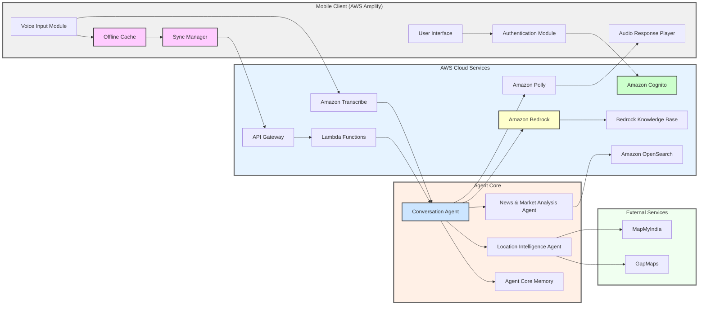

# Design Document: Vyapari Sahayak

## Overview

Vyapari Sahayak is a voice-first AI application that provides context-aware business guidance to small business owners and local vendors. The system architecture is designed around three core principles:

1. **Voice-First Interaction**: All primary interactions occur through voice, with text as a fallback
2. **Context Awareness**: The system maintains conversation history and user preferences to provide personalized guidance
3. **Offline Resilience**: Core functionality works in low-connectivity environments with graceful degradation

The application consists of a mobile client (Android/iOS) and a cloud backend that handles AI processing, context management, and data persistence. The architecture supports both online and offline modes, with automatic synchronization when connectivity is restored.

**Implementation Note:** The backend services (Lambda functions, Agent Core, Context Manager, etc.) are implemented in Python 3.11+. The mobile client uses platform-native frameworks (Swift for iOS, Kotlin for Android) with AWS Amplify for backend integration. All code examples in this document use Python syntax for backend components.

## Architecture

### High-Level Architecture

The system is built on AWS Cloud infrastructure with a multi-agent architecture powered by Amazon Bedrock. The architecture consists of:

1. **Mobile Client Layer**: Android/iOS application with offline capabilities (built with Amazon Amplify)
2. **Authentication Layer**: Amazon Cognito for OTP-based user authentication
3. **API Gateway Layer**: AWS Lambda functions for serverless orchestration
4. **Agent Core Layer**: Multi-agent system with specialized agents for different tasks
5. **AI Services Layer**: Amazon Bedrock for natural language generation, Amazon Transcribe for speech-to-text, Amazon Polly for text-to-speech
6. **Knowledge Layer**: Bedrock Knowledge Base for domain knowledge retrieval
7. **Search Layer**: Amazon OpenSearch Service for indexed search and semantic retrieval
8. **External Integration Layer**: MapMyIndia and GapMaps for location intelligence



### Component Responsibilities

**Mobile Client Components:**
- **User Interface**: Renders the voice-first UI with large buttons, icons, and minimal text (built with Amazon Amplify)
- **Authentication Module**: Handles OTP-based login via Amazon Cognito
- **Voice Input Module**: Captures audio, manages recording state, provides visual feedback
- **Audio Response Player**: Plays synthesized speech responses with playback controls
- **Offline Cache**: Stores conversation data, cached responses, preloaded audio guidance, and voice playlists locally
- **Sync Manager**: Detects connectivity changes and synchronizes data with the backend

**AWS Cloud Components:**
- **Amazon Amplify**: Provides mobile app development framework, hosting, and backend integration
- **Amazon Cognito**: Manages user authentication, OTP delivery, and session tokens
- **API Gateway + Lambda**: Routes requests, handles authentication, manages serverless orchestration
- **Amazon Transcribe**: Converts audio to text, handles multi-language recognition
- **Amazon Polly**: Converts text responses to natural-sounding audio
- **Agent Core**: Orchestrates multiple specialized agents
  - **Conversation Agent**: Primary agent handling user interactions and intent interpretation
  - **Location Intelligence Agent**: Processes location data, evaluates landmarks and environmental cues
  - **News & Market Analysis Agent**: Analyzes market trends and news relevant to user's business
  - **Agent Core Memory**: Maintains conversation state and long-term context
- **Amazon Bedrock**: Provides natural language generation and reasoning capabilities
- **Bedrock Knowledge Base**: Domain knowledge repository for business guidance (RAG)
- **Amazon OpenSearch Service**: Indexed search and semantic retrieval for news and market data

**External Integration Components:**
- **MapMyIndia**: Provides location and map intelligence for Indian regions
- **GapMaps**: External location intelligence and mapping service

### Communication Patterns

**Online Mode with Authentication:**
1. User opens app → Authentication Module checks session
2. If not authenticated → Cognito sends OTP → User verifies
3. User speaks → Voice Input Module captures audio
4. Audio sent to Amazon Transcribe via API Gateway/Lambda
5. Transcribed text sent to Conversation Agent in Agent Core
6. Conversation Agent interprets intent and delegates to specialized agents:
   - Location Intelligence Agent for location-related queries
   - News & Market Analysis Agent for market trends
7. Agents use Amazon Bedrock for reasoning and Bedrock Knowledge Base for domain knowledge
8. Conversation Agent generates response
9. Amazon Polly converts response to audio
10. Audio streamed back to Audio Response Player

**Offline Mode:**
1. App starts → System checks internet connectivity
2. If offline → Display offline content (preloaded audio guidance, voice playlists)
3. User speaks → Voice Input Module captures audio
4. Audio stored in Offline Cache with timestamp
5. Offline Cache provides cached responses or basic prompts
6. When connectivity restored → Sync Manager uploads cached data
7. Backend processes offline interactions and updates context

## Implementation Language

**Primary Language**: Python 3.11+

**Key Libraries and Frameworks:**
- **Backend**: AWS Lambda with Python runtime, boto3 for AWS SDK
- **Agent Framework**: LangChain for agent orchestration
- **Property-Based Testing**: Hypothesis
- **Unit Testing**: pytest
- **Type Hints**: Python typing module for type safety
- **Data Validation**: Pydantic for data models
- **Async Operations**: asyncio for asynchronous operations

## Components and Interfaces

### Authentication Module

**Responsibilities:**
- Handle OTP-based user authentication
- Manage session tokens via Amazon Cognito
- Verify user identity
- Handle authentication errors and retries
- Maintain secure authentication state

**Interface:**
```python
from typing import Optional
from dataclasses import dataclass
from abc import ABC, abstractmethod

@dataclass
class OTPResponse:
    success: bool
    message: str
    expires_in: int  # seconds

@dataclass
class AuthResult:
    success: bool
    session_token: Optional[str] = None
    user_id: Optional[str] = None
    error: Optional[str] = None

class AuthenticationModule(ABC):
    """Handle OTP-based user authentication"""
    
    @abstractmethod
    async def request_otp(self, phone_number: str) -> OTPResponse:
        """Request OTP for phone number"""
        pass
    
    @abstractmethod
    async def verify_otp(self, phone_number: str, otp: str) -> AuthResult:
        """Verify OTP and authenticate user"""
        pass
    
    @abstractmethod
    def is_authenticated(self) -> bool:
        """Check if user is authenticated"""
        pass
    
    @abstractmethod
    async def get_session_token(self) -> Optional[str]:
        """Get current session token"""
        pass
    
    @abstractmethod
    async def refresh_token(self) -> str:
        """Refresh session token"""
        pass
    
    @abstractmethod
    async def logout(self) -> None:
        """Logout user"""
        pass
```

### Voice Input Module

**Responsibilities:**
- Capture audio from device microphone
- Manage recording state (idle, recording, processing)
- Provide visual feedback during recording
- Support both voice and text input modes
- Handle audio format conversion and compression

**Interface:**
```python
from enum import Enum
from typing import Literal
from dataclasses import dataclass

class RecordingState(Enum):
    IDLE = "idle"
    RECORDING = "recording"
    PROCESSING = "processing"

@dataclass
class AudioFormat:
    sample_rate: int
    channels: int
    encoding: Literal['pcm', 'opus', 'aac']

@dataclass
class AudioData:
    buffer: bytes
    format: AudioFormat
    duration: float
    timestamp: int

class VoiceInputModule(ABC):
    """Capture and process voice input"""
    
    @abstractmethod
    async def start_recording(self) -> None:
        """Start capturing audio"""
        pass
    
    @abstractmethod
    async def stop_recording(self) -> AudioData:
        """Stop capturing audio and return audio data"""
        pass
    
    @abstractmethod
    def get_recording_state(self) -> RecordingState:
        """Get current recording state"""
        pass
    
    @abstractmethod
    def enable_text_input(self) -> None:
        """Switch to text input mode"""
        pass
    
    @abstractmethod
    async def submit_text(self, text: str) -> None:
        """Submit text input"""
        pass
```

### Speech-to-Text Service

**Responsibilities:**
- Convert audio to text with high accuracy
- Support multi-language recognition
- Filter background noise
- Provide confidence scores
- Handle audio streaming for real-time transcription

**Interface:**
```typescript
interface SpeechToTextService {
  // Transcribe audio to text
  transcribe(audio: AudioData): Promise<TranscriptionResult>
  
  // Stream audio for real-time transcription
  streamTranscribe(audioStream: ReadableStream<AudioData>): AsyncIterator<PartialTranscription>
  
  // Set language preferences
  setLanguages(languages: string[]): void
}

interface TranscriptionResult {
  text: string
  confidence: number
  language: string
  alternatives?: TranscriptionAlternative[]
}

interface TranscriptionAlternative {
  text: string
  confidence: number
}

interface PartialTranscription {
  text: string
  isFinal: boolean
  confidence: number
}
```

### Context Manager

**Responsibilities:**
- Extract entities from user input (business type, location, preferences)
- Store and retrieve conversation history
- Maintain user profiles with business context
- Provide relevant context for guidance generation
- Handle context updates and persistence

**Interface:**
```typescript
interface ContextManager {
  // Extract context from user input
  extractContext(text: string, sessionId: string): Promise<ExtractedContext>
  
  // Get current context for a session
  getSessionContext(sessionId: string): Promise<SessionContext>
  
  // Update context with new information
  updateContext(sessionId: string, context: Partial<SessionContext>): Promise<void>
  
  // Create a new session
  createSession(userId: string): Promise<string>
  
  // Close a session
  closeSession(sessionId: string): Promise<void>
  
  // Get user profile
  getUserProfile(userId: string): Promise<UserProfile>
}

interface ExtractedContext {
  businessType?: string
  location?: LocationInfo
  preferences?: Record<string, any>
  entities: Entity[]
}

interface SessionContext {
  sessionId: string
  userId: string
  businessType?: string
  location?: LocationInfo
  preferences: Record<string, any>
  conversationHistory: Message[]
  createdAt: number
  lastUpdated: number
}

interface LocationInfo {
  explicit?: string
  landmarks: string[]
  environmentalCues: string[]
  inferredLocation?: string
}

interface Entity {
  type: string
  value: string
  confidence: number
}

interface Message {
  role: 'user' | 'assistant'
  content: string
  timestamp: number
}

interface UserProfile {
  userId: string
  businessType?: string
  preferredLanguages: string[]
  location?: LocationInfo
  preferences: Record<string, any>
  sessionCount: number
  lastActive: number
}
```

### Business Advisor (Agent Core)

**Responsibilities:**
- Orchestrate multiple specialized agents (Conversation, Location Intelligence, News & Market Analysis)
- Interpret user intent and delegate to appropriate agents
- Generate business guidance based on context using Amazon Bedrock
- Query Bedrock Knowledge Base for domain-specific information
- Ask proactive questions to gather missing context
- Provide domain-specific recommendations
- Tailor advice to business type, location, and conditions
- Format responses for audio delivery
- Coordinate agent collaboration for complex queries

**Interface:**
```typescript
interface BusinessAdvisor {
  // Generate guidance based on context (orchestrates agents)
  generateGuidance(context: SessionContext, userInput: string): Promise<GuidanceResponse>
  
  // Determine if more context is needed
  needsMoreContext(context: SessionContext): boolean
  
  // Generate a proactive question
  generateQuestion(context: SessionContext): Promise<string>
  
  // Delegate to Location Intelligence Agent
  getLocationInsights(location: LocationInfo): Promise<LocationInsights>
  
  // Delegate to News & Market Analysis Agent
  getMarketAnalysis(businessType: string, location?: LocationInfo): Promise<MarketAnalysis>
}

interface GuidanceResponse {
  text: string
  type: 'guidance' | 'question' | 'clarification'
  confidence: number
  sources?: string[] // Knowledge base sources
  agentsInvolved?: string[] // Which agents contributed
  metadata?: Record<string, any>
}

interface LocationInsights {
  landmarks: string[]
  nearbyBusinesses: string[]
  footTraffic: string
  accessibility: string
  recommendations: string[]
}

interface MarketAnalysis {
  trends: string[]
  opportunities: string[]
  risks: string[]
  competitorActivity: string
  seasonalFactors: string[]
}
```

### Text-to-Speech Service

**Responsibilities:**
- Convert text to natural-sounding audio
- Support multiple languages and voices
- Optimize audio for mobile playback
- Handle audio streaming
- Provide playback metadata

**Interface:**
```typescript
interface TextToSpeechService {
  // Synthesize text to audio
  synthesize(text: string, options: TTSOptions): Promise<AudioData>
  
  // Stream audio synthesis
  streamSynthesize(text: string, options: TTSOptions): ReadableStream<AudioData>
  
  // Get available voices
  getVoices(language: string): Promise<Voice[]>
}

interface TTSOptions {
  language: string
  voice?: string
  speed?: number
  pitch?: number
}

interface Voice {
  id: string
  name: string
  language: string
  gender: 'male' | 'female' | 'neutral'
}
```

### Location Intelligence Agent

**Responsibilities:**
- Process location descriptions and environmental cues
- Query external mapping services (MapMyIndia, GapMaps)
- Evaluate landmarks and nearby places
- Provide location-specific business insights
- Assess foot traffic and accessibility
- Identify nearby competitors and complementary businesses

**Interface:**
```typescript
interface LocationIntelligenceAgent {
  // Analyze location from description
  analyzeLocation(description: string): Promise<LocationAnalysis>
  
  // Get insights for a specific location
  getLocationInsights(location: LocationInfo): Promise<LocationInsights>
  
  // Evaluate business suitability for location
  evaluateLocationForBusiness(location: LocationInfo, businessType: string): Promise<LocationSuitability>
}

interface LocationAnalysis {
  inferredLocation?: string
  landmarks: string[]
  nearbyPlaces: string[]
  confidence: number
  coordinates?: { lat: number; lng: number }
}

interface LocationSuitability {
  score: number // 0-100
  strengths: string[]
  weaknesses: string[]
  recommendations: string[]
}
```

### News and Market Analysis Agent

**Responsibilities:**
- Query Amazon OpenSearch for relevant news and market data
- Analyze market trends for specific business types
- Identify opportunities and risks
- Track competitor activity
- Provide seasonal and temporal insights
- Aggregate information from multiple sources

**Interface:**
```typescript
interface NewsAndMarketAnalysisAgent {
  // Get market analysis for business type and location
  analyzeMarket(businessType: string, location?: LocationInfo): Promise<MarketAnalysis>
  
  // Get recent news relevant to business
  getRelevantNews(businessType: string, location?: LocationInfo): Promise<NewsItem[]>
  
  // Identify market opportunities
  identifyOpportunities(context: SessionContext): Promise<Opportunity[]>
  
  // Track trends over time
  getTrends(businessType: string, timeframe: string): Promise<Trend[]>
}

interface NewsItem {
  title: string
  summary: string
  source: string
  publishedAt: number
  relevanceScore: number
  category: string
}

interface Opportunity {
  description: string
  confidence: number
  potentialImpact: 'high' | 'medium' | 'low'
  timeframe: string
  actionItems: string[]
}

interface Trend {
  name: string
  direction: 'rising' | 'falling' | 'stable'
  strength: number // 0-100
  description: string
  timeframe: string
}
```

### Offline Cache

**Responsibilities:**
- Store conversation data locally
- Cache frequently used responses
- Store preloaded audio guidance and voice playlists for offline use
- Provide basic prompts when offline
- Queue data for synchronization
- Manage storage limits

**Interface:**
```typescript
interface OfflineCache {
  // Store conversation data
  storeConversation(sessionId: string, messages: Message[]): Promise<void>
  
  // Get cached response
  getCachedResponse(query: string): Promise<string | null>
  
  // Get preloaded offline content
  getOfflineContent(): Promise<OfflineContent>
  
  // Store audio for later upload
  queueAudio(audio: AudioData, sessionId: string): Promise<void>
  
  // Get queued data for sync
  getQueuedData(): Promise<QueuedData[]>
  
  // Clear synced data
  clearSynced(ids: string[]): Promise<void>
  
  // Get storage usage
  getStorageInfo(): Promise<StorageInfo>
}

interface OfflineContent {
  audioGuidance: AudioGuidanceItem[]
  voicePlaylists: VoicePlaylist[]
  commonScenarios: CachedScenario[]
}

interface AudioGuidanceItem {
  id: string
  title: string
  category: string
  audioUrl: string
  duration: number
  language: string
}

interface VoicePlaylist {
  id: string
  name: string
  description: string
  items: AudioGuidanceItem[]
}

interface CachedScenario {
  query: string
  response: string
  businessType?: string
  language: string
}

interface QueuedData {
  id: string
  type: 'audio' | 'text' | 'context' | 'feedback'
  data: any
  sessionId: string
  timestamp: number
}

interface StorageInfo {
  used: number
  available: number
  limit: number
}
```

### Sync Manager

**Responsibilities:**
- Detect connectivity changes
- Upload queued data when online
- Download updated context
- Handle sync conflicts
- Retry failed synchronizations

**Interface:**
```typescript
interface SyncManager {
  // Start monitoring connectivity
  startMonitoring(): void
  
  // Stop monitoring
  stopMonitoring(): void
  
  // Manually trigger sync
  sync(): Promise<SyncResult>
  
  // Get sync status
  getSyncStatus(): SyncStatus
  
  // Register sync callback
  onSyncComplete(callback: (result: SyncResult) => void): void
}

interface SyncResult {
  success: boolean
  uploaded: number
  downloaded: number
  failed: number
  errors?: SyncError[]
}

interface SyncStatus {
  isOnline: boolean
  isSyncing: boolean
  lastSync?: number
  pendingItems: number
}

interface SyncError {
  itemId: string
  error: string
  retryCount: number
}
```

## Data Models

### User Profile Model

```typescript
interface UserProfile {
  userId: string
  phoneNumber?: string
  businessType?: string
  businessName?: string
  preferredLanguages: string[]
  location?: LocationInfo
  preferences: UserPreferences
  sessionCount: number
  totalInteractionTime: number
  createdAt: number
  lastActive: number
}

interface UserPreferences {
  voiceSpeed: number
  autoPlayResponses: boolean
  offlineMode: boolean
  notificationsEnabled: boolean
  customSettings: Record<string, any>
}
```

### Session Model

```typescript
interface Session {
  sessionId: string
  userId: string
  businessContext: BusinessContext
  conversationHistory: Message[]
  extractedEntities: Entity[]
  status: 'active' | 'closed'
  createdAt: number
  lastUpdated: number
  closedAt?: number
}

interface BusinessContext {
  businessType?: string
  location?: LocationInfo
  operatingConditions?: OperatingConditions
  currentQuery?: string
}

interface OperatingConditions {
  timeOfDay?: string
  crowdLevel?: string
  nearbyActivity?: string
  weather?: string
}
```

### Conversation Message Model

```typescript
interface Message {
  messageId: string
  sessionId: string
  role: 'user' | 'assistant'
  content: string
  audioUrl?: string
  metadata: MessageMetadata
  timestamp: number
}

interface MessageMetadata {
  language?: string
  confidence?: number
  processingTime?: number
  source: 'voice' | 'text'
  entities?: Entity[]
}
```

### Cached Response Model

```typescript
interface CachedResponse {
  cacheId: string
  query: string
  response: string
  audioData?: ArrayBuffer
  businessType?: string
  language: string
  hitCount: number
  createdAt: number
  lastUsed: number
  expiresAt: number
}
```

### User Feedback Model

```typescript
interface UserFeedback {
  feedbackId: string
  sessionId: string
  messageId: string // The guidance message being rated
  userId: string
  rating?: number // 1-5 stars
  voiceFeedback?: string // Transcribed voice feedback
  feedbackType: 'positive' | 'negative' | 'neutral'
  category?: string // e.g., 'accuracy', 'relevance', 'clarity'
  timestamp: number
}
```


## Correctness Properties

A property is a characteristic or behavior that should hold true across all valid executions of a system—essentially, a formal statement about what the system should do. Properties serve as the bridge between human-readable specifications and machine-verifiable correctness guarantees.

### Property Reflection

After analyzing all acceptance criteria, several redundancies were identified:
- Requirements 12.1 and 2.1 both test STT transcription timing (consolidated into Property 2)
- Requirements 12.3 and 7.1 both test TTS synthesis timing (consolidated into Property 7)
- Requirements 14.1 and 2.2 both test multi-language recognition (consolidated into Property 3)
- Multiple UI feedback properties (1.2, 7.2, 9.5, 10.3) test similar visual feedback patterns (consolidated into Property 20)
- Several context extraction properties (3.1, 3.2, 5.1, 5.3) test entity extraction (consolidated into Property 9)

### Voice Input Properties

**Property 1: Recording state transitions**
*For any* user interaction with the microphone button, tapping the button when idle should transition the Voice_Input_Module to recording state and begin audio capture.
**Validates: Requirements 1.1**

**Property 2: Silence detection triggers auto-stop**
*For any* audio input with a silence period exceeding 2 seconds, the Voice_Input_Module should automatically stop recording.
**Validates: Requirements 1.3**

**Property 3: Manual stop terminates recording**
*For any* active recording session, tapping the stop button should immediately transition the Voice_Input_Module to idle state and stop audio capture.
**Validates: Requirements 1.4**

**Property 4: Audio data transfer timing**
*For any* captured audio, the Voice_Input_Module should pass the audio data to the Speech_To_Text_Engine within 500ms of recording completion.
**Validates: Requirements 1.5**

### Speech Recognition Properties

**Property 5: Transcription timing**
*For any* valid audio input, the Speech_To_Text_Engine should complete transcription within 3 seconds.
**Validates: Requirements 2.1, 12.1**

**Property 6: Multi-language recognition**
*For any* audio containing speech in multiple languages, the Speech_To_Text_Engine should recognize and transcribe words from all languages present.
**Validates: Requirements 2.2, 14.1**

**Property 7: Noise filtering preserves accuracy**
*For any* clean audio input, adding background noise should not reduce transcription accuracy below an acceptable threshold (confidence > 0.7).
**Validates: Requirements 2.3**

**Property 8: Error handling for invalid audio**
*For any* audio input that cannot be transcribed, the Speech_To_Text_Engine should return an error code and a confidence score below 0.7.
**Validates: Requirements 2.4**

**Property 9: Transcription confidence threshold**
*For any* valid audio input with clear speech, the Speech_To_Text_Engine should produce transcription with confidence score above 0.7.
**Validates: Requirements 2.5**

### Context Management Properties

**Property 10: Entity extraction from user input**
*For any* user input containing business type, location, landmarks, or nearby places, the Context_Manager should extract and store the corresponding entities.
**Validates: Requirements 3.1, 3.2, 5.1, 5.3**

**Property 11: Preference persistence across sessions**
*For any* user preference stated in one session, the Context_Manager should make that preference available in all subsequent sessions for the same user.
**Validates: Requirements 3.3**

**Property 12: Context retrieval on session start**
*For any* new session for a user with previous sessions, the Context_Manager should retrieve and include relevant context from the most recent session.
**Validates: Requirements 3.4**

**Property 13: Context persistence timing**
*For any* context update, the Context_Manager should persist the changes to storage within 1 second.
**Validates: Requirements 3.5**

**Property 14: Explicit location prioritization**
*For any* session context containing both explicit location and inferred location, the Context_Manager should prioritize the explicit location in all operations.
**Validates: Requirements 5.4**

**Property 15: Multi-cue location inference**
*For any* user input containing multiple environmental cues (landmarks, crowd patterns, nearby places), the Context_Manager should combine all cues to build a comprehensive location understanding.
**Validates: Requirements 5.2, 5.5**

### Business Advisor Properties

**Property 16: Proactive questioning for missing context**
*For any* session context missing business type, location, or operating conditions, the Business_Advisor should generate a question to gather the missing information rather than providing guidance.
**Validates: Requirements 4.1, 4.2, 4.3**

**Property 17: Guidance generation with sufficient context**
*For any* session context containing business type, location, and user query, the Business_Advisor should generate actionable guidance rather than asking questions.
**Validates: Requirements 4.4, 6.1**

**Property 18: Targeted follow-up questions**
*For any* user input providing partial information about a topic, the Business_Advisor should generate a follow-up question specifically about the missing details of that topic.
**Validates: Requirements 4.5**

**Property 19: Domain-specific recommendations**
*For any* two sessions with different business types but similar queries, the Business_Advisor should generate different recommendations tailored to each business type.
**Validates: Requirements 6.2**

**Property 20: Location-aware guidance**
*For any* session with location context, the Business_Advisor should generate guidance that references or considers the location information.
**Validates: Requirements 6.3**

**Property 21: Condition-aware advice**
*For any* session with operating conditions (time of day, crowd level, weather), the Business_Advisor should tailor advice to those specific conditions.
**Validates: Requirements 6.4**

**Property 22: Audio-friendly response formatting**
*For any* generated guidance text, the Business_Advisor should format it without special characters or formatting that would sound unnatural when spoken.
**Validates: Requirements 6.5**

### Text-to-Speech Properties

**Property 23: Audio synthesis timing**
*For any* text response, the Text_To_Speech_Engine should convert it to audio and begin playback within 2 seconds.
**Validates: Requirements 7.1, 12.3**

**Property 24: Playback control responsiveness**
*For any* active audio playback, tapping pause should immediately pause playback, and tapping replay should restart audio from the beginning.
**Validates: Requirements 7.3, 7.4**

### Text Input Properties

**Property 25: Text input mode availability**
*For any* configuration where text input is enabled, the Voice_Input_Module should display a text input field and allow text submission.
**Validates: Requirements 8.1, 8.2**

**Property 26: Text bypasses speech recognition**
*For any* text input submitted by the user, the Voice_Input_Module should pass the text directly to the Context_Manager without invoking the Speech_To_Text_Engine.
**Validates: Requirements 8.3, 8.4**

**Property 27: Mode switching capability**
*For any* session with text input enabled, the user should be able to switch between voice and text input modes, and both modes should function correctly.
**Validates: Requirements 8.5**

### Offline Functionality Properties

**Property 28: Offline cache accessibility**
*For any* previously cached guidance, when connectivity is lost, the Offline_Cache should provide access to that cached content.
**Validates: Requirements 9.1**

**Property 29: Offline voice capture**
*For any* user interaction with the microphone button when offline, the Voice_Input_Module should capture audio and store it locally.
**Validates: Requirements 9.2, 9.3**

**Property 30: Offline basic functionality**
*For any* user query when offline, the Business_Advisor should provide basic prompts or cached responses rather than failing completely.
**Validates: Requirements 9.4**

### Synchronization Properties

**Property 31: Connectivity detection timing**
*For any* transition from offline to online, the Sync_Manager should detect the connectivity change within 5 seconds.
**Validates: Requirements 10.1**

**Property 32: Queued data upload**
*For any* data queued while offline, when connectivity is restored, the Sync_Manager should upload all queued data to the server.
**Validates: Requirements 10.2**

**Property 33: Context update after sync**
*For any* successful synchronization, the Sync_Manager should update the Context_Manager with any new data received from the server.
**Validates: Requirements 10.4**

**Property 34: Sync retry with exponential backoff**
*For any* failed synchronization attempt, the Sync_Manager should retry with exponentially increasing delays, up to a maximum of 3 attempts.
**Validates: Requirements 10.5**

### User Interface Properties

**Property 35: Minimum touch target size**
*For any* button in the user interface, the touch target size should be at least 48x48 pixels.
**Validates: Requirements 11.1**

**Property 36: Icon and text pairing**
*For any* primary action button, the UI should display both an icon and a text label.
**Validates: Requirements 11.2**

**Property 37: Color contrast accessibility**
*For any* text and background color combination in the UI, the contrast ratio should meet WCAG AA standards (minimum 4.5:1 for normal text).
**Validates: Requirements 11.4**

**Property 38: Interaction feedback timing**
*For any* user interaction (tap, swipe, button press), the UI should provide visual feedback within 100ms.
**Validates: Requirements 11.5**

### Performance Properties

**Property 39: Guidance generation timing**
*For any* request for business guidance with complete context, the Business_Advisor should generate a response within 2 seconds.
**Validates: Requirements 12.2**

**Property 40: Progress indicator for long operations**
*For any* operation that takes longer than 10 seconds, the UI should display a progress indicator.
**Validates: Requirements 12.4**

**Property 41: End-to-end interaction timing**
*For any* complete voice interaction cycle (voice input → transcription → guidance → audio response), the total time should not exceed 7 seconds under normal network conditions.
**Validates: Requirements 12.5**

### Security Properties

**Property 42: Data encryption at rest**
*For any* conversation data stored by the Context_Manager, the data should be encrypted using AES-256.
**Validates: Requirements 13.4**

**Property 43: Transport layer security**
*For any* network communication between client and server, the connection should use TLS 1.3 or higher.
**Validates: Requirements 13.5**

**Property 44: Data deletion timing**
*For any* user data deletion request, the Context_Manager should remove all user data within 24 hours.
**Validates: Requirements 13.6**

**Property 45: Token-based authentication**
*For any* authenticated request, the System should use secure token-based authentication rather than transmitting credentials.
**Validates: Requirements 13.8**

**Property 46: OTP delivery timing**
*For any* phone number submitted for authentication, the Authentication_Module should send an OTP via SMS within 10 seconds.
**Validates: Requirements 13.2**

**Property 47: OTP verification**
*For any* valid OTP entered by the user, the Authentication_Module should authenticate the user and create a session token.
**Validates: Requirements 13.3**

**Property 48: First-time authentication prompt**
*For any* user opening the application for the first time without a valid session, the Authentication_Module should prompt for phone number and OTP verification.
**Validates: Requirements 13.1**

### Language Support Properties

**Property 46: Language preference matching**
*For any* user with a stored language preference, the Business_Advisor should generate responses in that preferred language.
**Validates: Requirements 14.2**

**Property 47: Language preference persistence**
*For any* detected language in user input, the Context_Manager should store it as the user's language preference for future sessions.
**Validates: Requirements 14.3**

**Property 48: Dynamic language adaptation**
*For any* user who switches languages mid-conversation, the System should adapt all subsequent responses to the new language.
**Validates: Requirements 14.4**

**Property 49: Connectivity check on startup**
*For any* application start, the System should check internet connectivity status within 5 seconds.
**Validates: Requirements 9.1**

**Property 50: Offline content presentation**
*For any* application start when connectivity is unavailable, the System should present offline content including preloaded audio guidance and voice playlists.
**Validates: Requirements 9.2**

### Session Management Properties

**Property 51: Session creation on app start**
*For any* user starting the application, the Context_Manager should create a new session with a unique identifier.
**Validates: Requirements 15.1, 15.2**

**Property 52: Session ID uniqueness**
*For any* two sessions created by the system, the session identifiers should be unique.
**Validates: Requirements 15.2**

**Property 53: Session data persistence**
*For any* session that ends, the Context_Manager should store the session data with a timestamp.
**Validates: Requirements 15.3**

**Property 54: Recent context retrieval**
*For any* returning user, the Context_Manager should retrieve context from the most recent session.
**Validates: Requirements 15.4**

**Property 55: Session timeout**
*For any* session with no user activity for 30 minutes, the Context_Manager should automatically close the session.
**Validates: Requirements 15.5**

### Error Handling Properties

**Property 54: Speech recognition failure recovery**
*For any* speech recognition failure, the System should prompt the user to speak again rather than failing silently.
**Validates: Requirements 16.1**

**Property 55: Graceful offline transition**
*For any* network connectivity failure during an active request, the System should switch to offline mode without crashing or losing user input.
**Validates: Requirements 16.2**

**Property 56: Audio playback fallback**
*For any* audio playback failure, the System should display the text response as a fallback.
**Validates: Requirements 16.3**

**Property 57: User-friendly error messages**
*For any* error that occurs, the System should provide an error message that is understandable to non-technical users, delivered via both audio and text.
**Validates: Requirements 16.4**

**Property 58: Critical error recovery options**
*For any* critical error, the System should log the error details and provide the user with options to retry the operation or exit gracefully.
**Validates: Requirements 16.5**

### Monitoring Properties

**Property 56: Response time logging**
*For any* voice interaction, the System should log the response time from input to output.
**Validates: Requirements 17.1**

**Property 57: Accuracy tracking**
*For any* speech recognition operation, the System should track and record the accuracy rate.
**Validates: Requirements 17.2**

**Property 58: Transition monitoring**
*For any* offline-to-online transition, the System should monitor and record whether the transition was successful.
**Validates: Requirements 17.3**

**Property 59: Engagement duration tracking**
*For any* session, the System should record the total user engagement duration.
**Validates: Requirements 17.4**

**Property 60: Usage frequency measurement**
*For any* user, the System should measure and record the frequency of repeat usage.
**Validates: Requirements 17.5**

### Caching Property

**Property 61: Cache reduces backend load**
*For any* frequently requested guidance, using cached responses should result in fewer backend requests compared to generating fresh responses every time.
**Validates: Requirements 18.5**

### Visual Feedback Property

**Property 62: Visual feedback for system state**
*For any* system state change (recording, processing, playing, syncing, offline), the UI should display appropriate visual feedback to indicate the current state.
**Validates: Requirements 1.2, 7.2, 9.7, 10.3**

### User Feedback Properties

**Property 63: Feedback option availability**
*For any* guidance delivered to the user, the System should provide an option to record feedback.
**Validates: Requirements 19.1**

**Property 64: Feedback storage with context**
*For any* user feedback provided, the System should store the feedback with the associated session and guidance response.
**Validates: Requirements 19.2, 19.3**

**Property 65: Multi-modal feedback support**
*For any* feedback mechanism, the System should allow users to provide feedback via voice or simple rating mechanism.
**Validates: Requirements 19.4**

## Error Handling

### Error Categories

**1. Input Errors**
- Invalid or corrupted audio data
- Empty or unintelligible speech
- Unsupported audio formats
- Text input validation failures

**Handling Strategy:**
- Validate audio format and quality before processing
- Provide clear feedback to user about the issue
- Prompt user to retry with guidance
- Log error details for monitoring

**2. Network Errors**
- Connection timeout
- Request failures
- Partial data transmission
- Server unavailability

**Handling Strategy:**
- Implement exponential backoff retry logic
- Switch to offline mode gracefully
- Queue data for later synchronization
- Display offline indicator to user

**3. Processing Errors**
- Speech recognition failures
- Context extraction errors
- Guidance generation failures
- Audio synthesis errors

**Handling Strategy:**
- Return error codes with confidence scores
- Provide fallback responses when possible
- Log errors for analysis
- Offer alternative interaction methods (text fallback)

**4. Storage Errors**
- Cache full
- Database write failures
- Encryption errors
- Data corruption

**Handling Strategy:**
- Implement cache eviction policies (LRU)
- Retry storage operations with backoff
- Validate data integrity before storage
- Alert user if critical data cannot be saved

**5. Authentication Errors**
- Invalid tokens
- Expired sessions
- Permission denied
- Rate limiting

**Handling Strategy:**
- Refresh tokens automatically when possible
- Prompt for re-authentication when necessary
- Implement graceful degradation for rate limits
- Log authentication failures for security monitoring

### Error Recovery Patterns

**Retry with Backoff:**
```typescript
async function retryWithBackoff<T>(
  operation: () => Promise<T>,
  maxAttempts: number = 3,
  baseDelay: number = 1000
): Promise<T> {
  for (let attempt = 1; attempt <= maxAttempts; attempt++) {
    try {
      return await operation()
    } catch (error) {
      if (attempt === maxAttempts) throw error
      const delay = baseDelay * Math.pow(2, attempt - 1)
      await sleep(delay)
    }
  }
  throw new Error('Max retry attempts exceeded')
}
```

**Graceful Degradation:**
```typescript
async function getGuidanceWithFallback(
  context: SessionContext,
  query: string
): Promise<GuidanceResponse> {
  try {
    // Try online guidance generation
    return await businessAdvisor.generateGuidance(context, query)
  } catch (error) {
    // Fall back to cached responses
    const cached = await offlineCache.getCachedResponse(query)
    if (cached) {
      return { text: cached, type: 'guidance', confidence: 0.5 }
    }
    // Final fallback to basic prompt
    return {
      text: 'I am currently offline. Please try again when connected.',
      type: 'clarification',
      confidence: 1.0
    }
  }
}
```

**Circuit Breaker:**
```typescript
class CircuitBreaker {
  private failureCount = 0
  private lastFailureTime = 0
  private state: 'closed' | 'open' | 'half-open' = 'closed'
  
  async execute<T>(operation: () => Promise<T>): Promise<T> {
    if (this.state === 'open') {
      if (Date.now() - this.lastFailureTime > 60000) {
        this.state = 'half-open'
      } else {
        throw new Error('Circuit breaker is open')
      }
    }
    
    try {
      const result = await operation()
      this.onSuccess()
      return result
    } catch (error) {
      this.onFailure()
      throw error
    }
  }
  
  private onSuccess() {
    this.failureCount = 0
    this.state = 'closed'
  }
  
  private onFailure() {
    this.failureCount++
    this.lastFailureTime = Date.now()
    if (this.failureCount >= 5) {
      this.state = 'open'
    }
  }
}
```

## Testing Strategy

### Dual Testing Approach

The testing strategy employs both unit tests and property-based tests to ensure comprehensive coverage:

**Unit Tests** focus on:
- Specific examples that demonstrate correct behavior
- Edge cases (empty input, maximum values, boundary conditions)
- Error conditions and error handling paths
- Integration points between components
- UI interactions and state transitions

**Property-Based Tests** focus on:
- Universal properties that hold for all inputs
- Comprehensive input coverage through randomization
- Invariants that must be maintained
- Round-trip properties (serialization, parsing)
- Timing and performance constraints

Both approaches are complementary and necessary. Unit tests catch concrete bugs in specific scenarios, while property tests verify general correctness across a wide range of inputs.

### Property-Based Testing Configuration

**Testing Library:** We will use **Hypothesis** for Python property-based testing.

**Configuration:**
- Minimum 100 examples per property test (to ensure statistical coverage)
- Each property test must reference its design document property
- Docstring format: `"""Feature: vyapari-sahayak, Property {number}: {property_text}"""`

**Example Property Test:**
```python
from hypothesis import given, strategies as st
import pytest

# Feature: vyapari-sahayak, Property 10: Entity extraction from user input
@given(
    business_type=st.one_of(st.none(), st.sampled_from(['restaurant', 'shop', 'vendor'])),
    location=st.one_of(st.none(), st.text(min_size=1)),
    landmarks=st.lists(st.text(min_size=1), max_size=5)
)
@pytest.mark.asyncio
async def test_context_manager_extracts_entities_from_any_user_input(
    business_type, location, landmarks
):
    """
    Feature: vyapari-sahayak, Property 10: Entity extraction from user input
    
    For any user input containing business type, location, landmarks, or nearby places,
    the Context_Manager should extract and store the corresponding entities.
    """
    # Arrange
    text = build_input_text(business_type, location, landmarks)
    context_manager = ContextManager()
    
    # Act
    result = await context_manager.extract_context(text, 'test-session')
    
    # Assert
    if business_type:
        assert result.business_type is not None
    if location:
        assert result.location is not None
    if len(landmarks) > 0:
        assert len(result.location.landmarks) > 0
```

### Unit Testing Strategy

**Component-Level Tests:**
- Voice Input Module: Test recording state transitions, audio capture, mode switching
- Speech-to-Text: Test transcription accuracy, language detection, error handling
- Context Manager: Test entity extraction, session management, persistence
- Business Advisor: Test question generation, guidance formatting, domain logic
- Text-to-Speech: Test audio synthesis, playback controls, voice selection
- Offline Cache: Test caching logic, storage limits, eviction policies
- Sync Manager: Test connectivity detection, upload/download, retry logic

**Integration Tests:**
- End-to-end voice interaction flow
- Offline-to-online transition
- Multi-language conversation handling
- Error recovery scenarios

**UI Tests:**
- Button interactions and visual feedback
- Accessibility compliance (touch targets, contrast)
- State rendering (recording, playing, syncing, offline)
- Text input fallback

### Test Coverage Goals

- **Line Coverage:** Minimum 80% for all components
- **Branch Coverage:** Minimum 75% for business logic
- **Property Coverage:** 100% of correctness properties must have corresponding property tests
- **Critical Path Coverage:** 100% for voice interaction flow, offline functionality, and error handling

### Performance Testing

While property-based tests validate functional correctness, performance testing validates timing requirements:

- Voice interaction cycle timing (Property 41: < 7 seconds)
- Transcription timing (Property 5: < 3 seconds)
- Audio synthesis timing (Property 23: < 2 seconds)
- Context persistence timing (Property 13: < 1 second)
- UI feedback timing (Property 38: < 100ms)

Performance tests should run in CI/CD pipeline with realistic network conditions and device constraints.

### Testing in Offline Mode

Special attention must be given to offline functionality testing:

1. **Offline Capture Tests:** Verify voice input works without connectivity
2. **Cache Tests:** Verify cached responses are accessible offline
3. **Queue Tests:** Verify data is queued correctly for later sync
4. **Sync Tests:** Verify queued data uploads when connectivity returns
5. **Graceful Degradation Tests:** Verify system provides basic functionality offline

### Security Testing

Security properties must be validated through specific tests:

- Encryption verification (Property 42: AES-256 at rest)
- TLS verification (Property 43: TLS 1.3 in transit)
- Authentication token validation (Property 45)
- Data deletion verification (Property 44: within 24 hours)

### Accessibility Testing

Accessibility properties require both automated and manual testing:

- Automated: Touch target sizes (Property 35), color contrast (Property 37)
- Manual: Screen reader compatibility, voice-first usability
- User testing: Test with target users (limited literacy, first-time smartphone users)

### Continuous Integration

All tests should run automatically on:
- Every pull request
- Every commit to main branch
- Nightly builds for comprehensive property test runs (with higher iteration counts)

Test failures should block deployment and trigger alerts for investigation.
